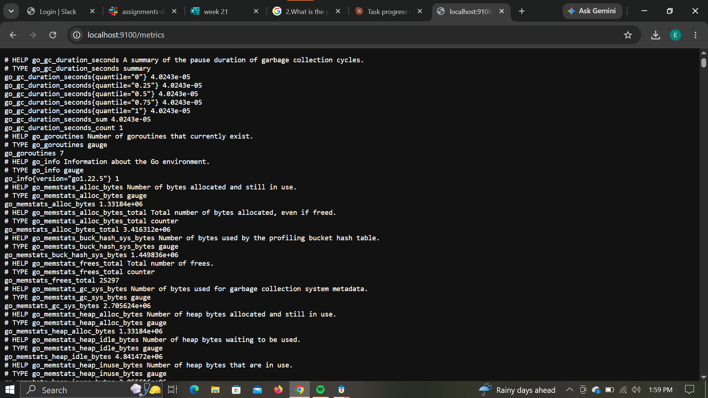
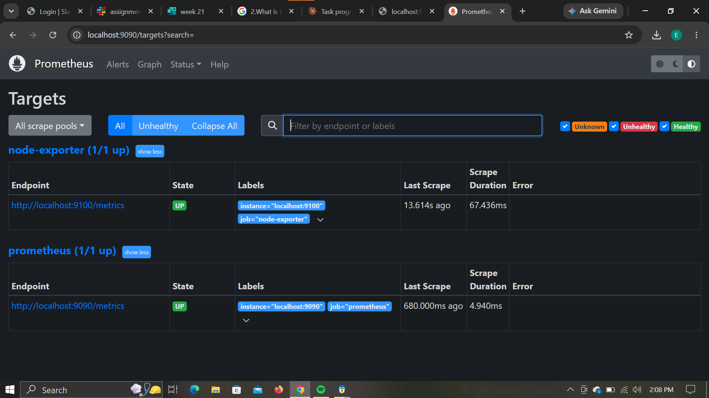
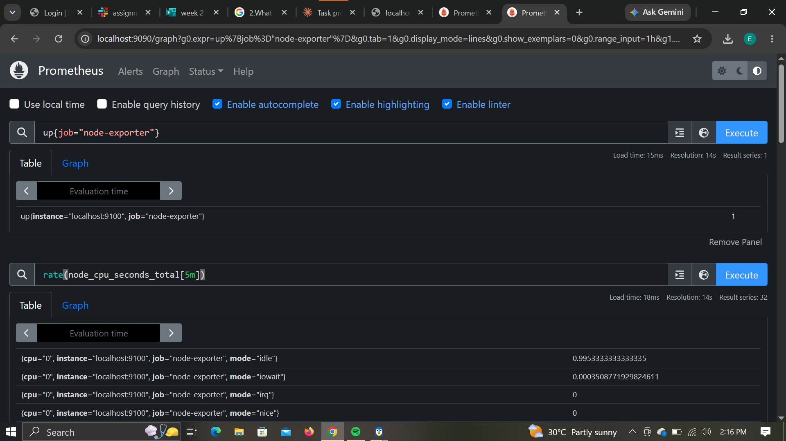

# Prometheus Configuration, Exporters & PromQL

### Student Information

Name: Ebubechukwu Ogbonna

## 1. Objective

Build a small Prometheus monitoring setup to demonstrate understanding of prometheus.yml, Prometheus targets, Node Exporter, scrape configuration, and PromQL queries. Node Exporter was run locally to expose machine metrics, Prometheus was configured to scrape both itself and Node Exporter, and five PromQL queries were tested against the collected data.

## 2. What is prometheus.yml?

prometheus.yml is Prometheus's main configuration file. It tells Prometheus how often to collect (scrape) metrics, and from where. Instead of Prometheus discovering things on its own, this file explicitly defines every "job" (a group of related targets) and the endpoints Prometheus should reach out to and pull metrics from at regular intervals. In this assignment, it defines two jobs: one that monitors Prometheus itself, and one that monitors Node Exporter.

## 3. Configuration Explanation

    global:
      scrape_interval: 15s

    scrape_configs:
      - job_name: "prometheus"
        static_configs:
          - targets: ["localhost:9090"]

      - job_name: "node-exporter"
        static_configs:
          - targets: ["localhost:9100"]

**global** - top-level settings that apply to the whole Prometheus instance unless overridden for a specific job.

**scrape_interval** - how often Prometheus pulls (scrapes) metrics from each target. Here it's set to 15 seconds, meaning every target is polled for fresh metrics every 15 seconds.

**scrape_configs** - the list of all the jobs Prometheus should run. Each entry describes one group of targets to monitor.

**job_name** - a label identifying a group of targets being monitored, e.g. "prometheus" or "node-exporter". This name shows up as the job label on every metric collected from that job, which is how PromQL queries can filter by job later.

**static_configs** - a way of manually listing the exact targets for a job, as opposed to using service discovery to find them automatically. Since this is a small local setup, targets are hardcoded here rather than discovered dynamically.

**targets** - the actual host:port addresses Prometheus should scrape metrics from. localhost:9090 is Prometheus's own metrics endpoint, and localhost:9100 is where Node Exporter exposes machine metrics.

## 4. Exporter Explanation

Node Exporter is a small standalone program that exposes hardware and OS-level metrics (CPU usage, memory, disk space, filesystem stats, network stats, etc.) about the machine it's running on, in a format Prometheus can scrape. Prometheus itself only knows how to collect metrics that are already exposed in its own text format on some HTTP endpoint - it has no built-in way to read raw system stats like CPU load or free memory. Node Exporter bridges that gap: it reads real system data and republishes it at localhost:9100/metrics, so Prometheus can scrape it as just another target, the same way it scrapes itself.

## 5. PromQL Queries

**Query 1 - Is the Node Exporter target up?**

    up{job="node-exporter"}

Result: 1

This confirms Prometheus is successfully scraping the Node Exporter target. The up metric is a built-in Prometheus metric that equals 1 if the last scrape of a target succeeded, and 0 if it failed. A result of 1 here means Node Exporter is reachable and responding correctly.

**Query 2 - CPU-related information**

    rate(node_cpu_seconds_total[5m])

Result: 32 separate time series, one per combination of CPU core and mode (idle, user, system, iowait, irq, softirq, nice, steal) across 4 CPU cores. For example, cpu="0", mode="idle" showed a value of about 0.995, while cpu="0", mode="user" showed about 0.0013.

This calculates the per-second rate of time each CPU core spent in each mode over the last 5 minutes. Since these are fractions of a second per second, a value close to 1 for "idle" means that core spent almost all its time doing nothing over that window, while the very small values for "user" and "system" show only a tiny fraction of time was spent actually running processes - consistent with a mostly-idle machine at the time of the query.

**Query 3 - Memory-related information**

    node_memory_MemAvailable_bytes

Result: 3461214208 (approximately 3.46 GB)

This shows how much memory is currently available for new processes to use, factoring in memory that could be freed from caches/buffers if needed - not just raw free memory. It's generally a more accurate "how much memory can I actually use right now" figure than a simpler free-memory metric.

**Query 4 - Disk/filesystem-related information**

    node_filesystem_avail_bytes

Result: 15 separate time series, one per mounted filesystem on the machine. For example, the root filesystem (mountpoint="/") showed about 1014202556416 bytes (roughly 945 GB) available, while a tmpfs mount like /run showed around 2027732992 bytes (roughly 1.9 GB).

This shows the available (non-reserved) space on every filesystem mounted on the machine, broken down per mountpoint and device. Since this environment runs under WSL, the results include both the Linux root filesystem and Windows-side mounts (like /mnt/c), each reported as its own separate series.

**Query 5 - Filtering using a label**

    node_filesystem_avail_bytes{mountpoint="/"}

Result: 1014202544128 (approximately 945 GB), a single series.

This is the same metric as Query 4, but filtered down using a label selector ({mountpoint="/"}) to return only the one series for the root filesystem, instead of all 15. This demonstrates how PromQL label filters let you narrow a broad metric down to exactly the specific series you care about, which becomes essential once a real system has many instances, jobs, or devices being monitored at once.

## 6. Screenshots

### Node Exporter Metrics
 - the Node Exporter metrics endpoint at localhost:9100/metrics, confirming it exposes raw metrics text

### Prometheus Targets
 - the Prometheus Targets page showing both the prometheus and node-exporter jobs with state UP

### PromQL Query Result
 - a successful PromQL query executed in the Prometheus UI
